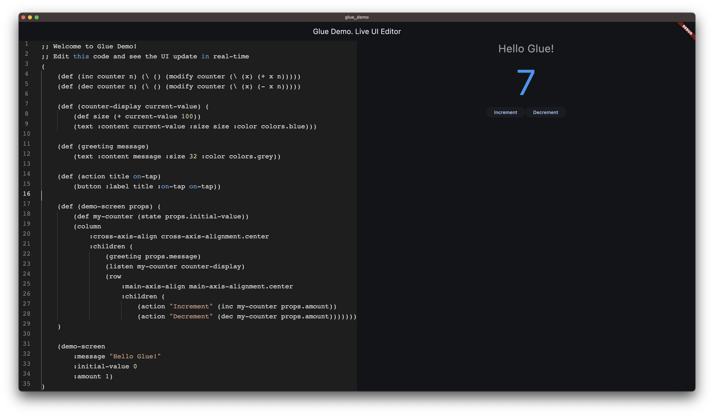

# Glue Flutter

Flutter bindings for the Glue programming language - enabling Glue code to create and manipulate Flutter widgets.

## Overview

Glue Flutter provides a framework-agnostic UI module implementation for Flutter, allowing you to write UI code once and run it across different platforms. The same Glue code can produce Flutter widgets for mobile, desktop, and web applications.



*Glue Flutter bindings in action - showing the UI framework capabilities*

## Features

- **Framework-Agnostic API**: Write UI code once, run everywhere
- **Native Flutter Widgets**: Direct integration with Flutter's widget system
- **Type Safety**: Full type checking through Glue's evaluation model
- **Hot Reload Support**: Compatible with Flutter's development workflow


## Supported Widgets

### Core Widgets
- `text` - Display text with styling
- `button` - Interactive buttons with callbacks
- `container` - Container for padding, color, and single child
- `padding` - Add padding around widgets

### Layout Widgets
- `column` - Vertical layout container
- `row` - Horizontal layout container
- `center` - Center child widgets
- `sized-box` - Creates a box with specific width and height

## Enum Constants

Glue Flutter provides direct access to Flutter enum values through **enum union objects**. Instead of using string parsing, you access enum values directly as object properties.

### Available Enum Objects

#### `cross-axis-alignment`
Cross-axis alignment values for layout widgets:
- `cross-axis-alignment.start`
- `cross-axis-alignment.end`
- `cross-axis-alignment.center`
- `cross-axis-alignment.stretch`
- `cross-axis-alignment.baseline`

#### `main-axis-alignment`
Main-axis alignment values for layout widgets:
- `main-axis-alignment.start`
- `main-axis-alignment.end`
- `main-axis-alignment.center`
- `main-axis-alignment.spaceBetween`
- `main-axis-alignment.spaceAround`
- `main-axis-alignment.spaceEvenly`

#### `text-align`
Text alignment values:
- `text-align.left`
- `text-align.right`
- `text-align.center`
- `text-align.justify`
- `text-align.start`
- `text-align.end`

#### `font-weight`
Font weight values:
- `font-weight.normal`
- `font-weight.bold`
- `font-weight.w100`, `font-weight.w200`, ..., `font-weight.w900`

#### `colors`
Material Design color constants:
- Primary colors: `colors.red`, `colors.blue`, `colors.green`, etc.
- Accent colors: `colors.redAccent`, `colors.blueAccent`, etc.
- Special colors: `colors.black`, `colors.white`, `colors.transparent`

### Usage Examples

```clojure
;; Using enum constants directly (type-safe, no string parsing!)
(column
  :cross-axis-alignment cross-axis-alignment.center
  :main-axis-alignment main-axis-alignment.spaceEvenly
  :children
    (text :content "Hello World"
          :color colors.blue
          :weight font-weight.bold
          :align text-align.center))
```

```clojure
;; Button with color enum
(button
  :label "Click Me"
  :color colors.red)
```

## Widget Properties

### Common Properties
- `:color` - Color enum values (`colors.red`, `colors.blue`, etc.) OR string values ("red", "#FF0000")
- `:size` - Numeric sizes (points for mobile, pixels for web)
- `:padding` - Padding values

### Text Properties
- `:weight` - Font weight enum values (`font-weight.normal`, `font-weight.bold`) OR strings ("normal", "bold")
- `:align` - Text alignment enum values (`text-align.left`, `text-align.center`) OR strings ("left", "center")

### Button Properties
- `:label` - Button text (required)
- `:on-tap` - Tap callback function
- `:disabled` - Boolean to disable interaction

### Layout Properties
- `:cross-axis-alignment` - Cross-axis alignment enum values
- `:main-axis-alignment` - Main-axis alignment enum values
- `:children` - List of child widgets (required)
- `:direction` - Layout direction ("vertical", "horizontal")
- `:spacing` - Space between children

### Sized Box Properties
- `:width` - Width of the box
- `:height` - Height of the box
- `:child` - Child widget to contain

## Architecture

### Module System
Glue Flutter implements the `ffi.ui` module, providing a consistent API across different UI frameworks.

### Widget Creation
Widgets are created through native functions that:
1. Take Glue property objects
2. Parse properties into appropriate types
3. Return `IrNativeValue` containing `Value` with Flutter widgets

## Development

### Project Structure
```
flutter/glue_flutter/
├── lib/
│   ├── glue_flutter.dart          # Main package export
│   └── src/
│       └── lib/
│           ├── ui.dart            # ffi.ui module implementation
│           └── ui/
│               ├── styles/        # Enum objects & color functions
│               └── widgets/       # Widget constructors
└── test/
    └── ui_test.dart               # Module tests
```

### Adding New Widgets

1. Read the [Glue Bindings How-To Guide](GLUE_BINDINGS_HOWTO.md) for comprehensive implementation details
2. Create widget constructor in `lib/src/lib/ui/widgets/`
3. Add native function in `lib/src/lib/ui.dart`
4. Register in module exports
5. Add tests

## Contributing

1. Follow the Glue development rules
2. Maintain Haskell reference implementation compatibility
3. Add comprehensive tests
4. Update documentation

## License

Part of the Glue project. See project LICENSE for details.
